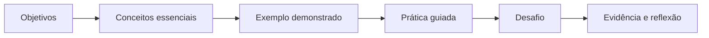

---
hide:
  - toc
---

:material-server-network: Material didático sequencial

# Administração de Sistemas Operacionais

Instalação, configuração, proteção e monitoramento de servidores, com aprendizagem baseada em laboratório e resolução de problemas reais.

[Começar a disciplina :material-arrow-right:](organizacao/index.md){ .md-button .md-button--primary }
[Consultar o plano](organizacao/plano-de-ensino.md){ .md-button }

**Lourenço José Cavalcante Neto**

Professor EBTT de Computação — IFTO
Mestre e doutorando em Computação Aplicada — INPE
Desenvolvimento de Sistemas, Banco de Dados e Inteligência Artificial

## Sobre a disciplina

A disciplina prepara o estudante para administrar sistemas operacionais de servidores por meio de uma sequência que parte dos fundamentos, passa pelo domínio da linha de comando e chega à implantação segura de serviços. O foco não é apenas memorizar comandos: é **observar o estado do sistema, formular hipóteses, executar mudanças controladas, validar resultados e registrar evidências**.

<a class="course-card" href="unidade-1/" markdown>
:material-server:
### Unidade I — Fundamentos
Arquitetura de servidores, virtualização e instalação de sistemas operacionais.
</a>
<a class="course-card" href="unidade-2/" markdown>
:material-console-line:
### Unidade II — GNU/Linux
Shell, comandos, filtros, scripts, processos, serviços e registros do sistema.
</a>
<a class="course-card" href="unidade-3/" markdown>
:material-shield-lock:
### Unidade III — Administração
Pacotes, usuários, discos, rede, segurança, monitoramento e backup.
</a>
<a class="course-card" href="unidade-4/" markdown>
:material-lan:
### Unidade IV — Serviços
Impressão, Web, transferência de arquivos, NFS, Samba e integração.
</a>
<a class="course-card" href="projeto-final/" markdown>
:material-clipboard-check-outline:
### Projeto final
Planejamento e implantação documentada de um servidor para uma organização.
</a>
<a class="course-card" href="referencias/guia-comandos/" markdown>
:material-book-open-page-variant:
### Consulta rápida
Comandos essenciais e roteiro de diagnóstico para uso durante os laboratórios.
</a>

## Competências e habilidades

Ao concluir o percurso, o estudante deverá ser capaz de:

- compreender a instalação, a configuração e a administração de recursos de hardware e serviços em sistemas operacionais modernos;
- identificar e utilizar elementos de um sistema operacional de servidor;
- executar tarefas administrativas pela linha de comando de forma rastreável;
- reconhecer sintomas, investigar causas e testar soluções para problemas operacionais;
- instalar, configurar, proteger e monitorar serviços de rede;
- documentar mudanças, testes, riscos e procedimentos de recuperação.

!!! info "Como estudar neste material"
    Siga as páginas na ordem indicada no rodapé. Execute os comandos em uma máquina virtual, registre as evidências solicitadas e marque a aula como concluída. As caixas **Atenção** indicam operações que podem afetar o sistema.

## Dinâmica de cada aula

!!! warning "Ambiente isolado"
    As atividades administrativas devem ser realizadas em máquinas virtuais ou equipamentos destinados ao laboratório. Nunca teste comandos destrutivos em computadores de produção.
