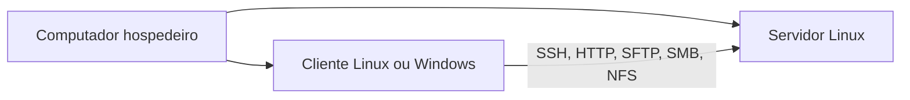

# Ambiente de laboratório

## Topologia mínima

Cada estudante ou dupla deverá manter ao menos duas máquinas virtuais:



## Requisitos recomendados

- virtualizador disponível no laboratório: VirtualBox, VMware, Hyper-V ou KVM;
- uma VM de servidor com 2 vCPUs, 2 a 4 GB de RAM e dois discos virtuais;
- uma VM cliente ou o próprio hospedeiro para testes;
- rede NAT para acesso externo e rede interna/host-only para comunicação do laboratório;
- imagem de uma distribuição GNU/Linux Server suportada no ambiente institucional;
- snapshots antes de práticas de armazenamento, rede e segurança.

## Convenção de nomes

| Item | Exemplo |
|---|---|
| servidor | `srv01` |
| cliente | `cli01` |
| domínio de laboratório | `lab.local` |
| usuário administrador | `adminlab` |
| rede interna | `192.168.56.0/24` |

## Preparação

- [ ] habilitar virtualização no firmware, quando necessário;
- [ ] criar a pasta da disciplina;
- [ ] verificar o hash da imagem ISO, quando fornecido;
- [ ] registrar CPU, RAM, discos e interfaces da VM;
- [ ] criar um snapshot após a instalação limpa;
- [ ] testar acesso entre cliente e servidor.

!!! danger "Não use credenciais reais"
    O laboratório deve usar senhas exclusivas e dados fictícios. Chaves, senhas e arquivos de configuração contendo segredos não devem ser enviados para repositórios públicos.

## Modelo de registro

```text
Data:
Aluno(s):
Máquina:
Snapshot inicial:
Objetivo:
Mudanças executadas:
Teste realizado:
Resultado:
Procedimento de reversão:
```
