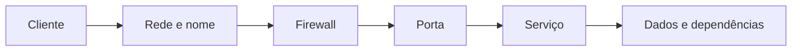

# 01. Sistemas de servidores

Aula 012 aulasFundamentos

## Objetivos

- explicar o que diferencia um servidor de um computador de uso geral
- relacionar hardware, sistema operacional e serviço
- identificar requisitos de disponibilidade, capacidade e segurança

## Servidor é uma função

Um servidor é um sistema que disponibiliza recursos ou serviços para clientes. A mesma máquina pode atuar como servidor Web, arquivos e impressão, mas a concentração de papéis aumenta impacto de falhas e complexidade operacional.

| Camada | Pergunta administrativa |
|---|---|
| hardware/VM | há CPU, memória, armazenamento e rede suficientes? |
| sistema operacional | está suportado, atualizado e configurado? |
| serviço | está ativo, acessível e restrito ao público correto? |
| dados | há integridade, cópia de segurança e recuperação testada? |
| operação | alguém monitora, documenta e responde a incidentes? |

## Papéis comuns

- autenticação e diretório;
- arquivos e impressão;
- aplicação e banco de dados;
- Web e proxy;
- DNS, DHCP e tempo;
- monitoramento e backup.

## Disponibilidade e risco

A disponibilidade depende de mais que manter o processo ativo. Um servidor pode estar ligado e ainda assim indisponível por falha de DNS, rota, firewall, credencial, disco cheio ou configuração inválida.

!!! question "Pergunta de análise"
    Qual seria o impacto de hospedar, na mesma VM, o site institucional, os arquivos internos e o sistema de autenticação?

## Prática guiada

1. Liste cinco serviços usados diariamente na instituição.
2. Para cada serviço, identifique clientes, dados tratados, impacto de indisponibilidade e responsável provável.
3. Escolha um serviço e desenhe o caminho completo do cliente até os dados.
4. Classifique requisitos como essenciais, desejáveis ou dispensáveis.

Use a tabela:

| Serviço | Clientes | Porta/protocolo | Dados | Impacto | Controle necessário |
|---|---|---|---|---|---|
| exemplo: Web | navegadores | HTTP/HTTPS | páginas | médio | atualização e logs |

## Desafio

Uma escola precisa de arquivos compartilhados, página Web interna, impressão e acesso remoto da equipe de TI. Proponha uma arquitetura com uma ou mais VMs e justifique a separação dos serviços.

## Evidência de entrega

Diagrama da arquitetura proposta e um parágrafo justificando recursos, separação de papéis e riscos.

## Checklist

- [ ] defini servidor e cliente sem depender do formato físico
- [ ] identifiquei ao menos quatro camadas envolvidas na disponibilidade
- [ ] relacionei serviço, protocolo, dados e risco
- [ ] documentei a arquitetura proposta

