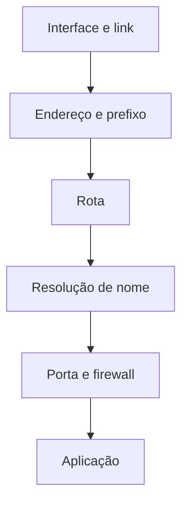

# 14. Rede e diagnóstico

<div class="lesson-meta"><span>Aula 14</span><span>4 aulas</span><span>Administração</span></div>

## Objetivos

- interpretar endereço, prefixo, rota e DNS
- configurar rede no ambiente do laboratório
- testar conectividade por camadas
- identificar portas em escuta

## Quatro perguntas iniciais

1. A interface está ativa e possui endereço?
2. Existe rota para o destino?
3. O nome resolve para o endereço esperado?
4. O serviço está escutando e permitido pelo firewall?

## Estado local

```bash
ip -brief link
ip -brief address
ip route
resolvectl status
ss -lntup
```

## Testes

```bash
ping -c 4 192.168.56.1
getent hosts srv01.lab.local
curl -I http://192.168.56.10
nc -vz 192.168.56.10 22
```

## Diagnóstico por camadas



## Configuração persistente

O mecanismo varia entre distribuições: NetworkManager, systemd-networkd, Netplan ou arquivos tradicionais. Identifique o gerenciador antes de editar.

```bash
systemctl is-active NetworkManager
systemctl is-active systemd-networkd
networkctl status
nmcli general status
```

!!! warning "Acesso remoto"
    Alterar endereço, rota ou firewall por SSH pode encerrar a sessão. Planeje acesso de console e reversão automática.

## Prática guiada

1. Registre interfaces, endereços, rotas e resolvedor.
2. Teste comunicação entre `cli01` e `srv01` pelo IP.
3. Crie resolução local por `/etc/hosts` para `srv01.lab.local`.
4. Teste pelo nome.
5. Identifique portas em escuta no servidor.
6. Pare temporariamente um serviço de laboratório e compare teste de porta e mensagem do cliente.
7. Restaure o serviço e valide.

## Desafio

O cliente alcança o IP do servidor, mas não o nome. Construa uma árvore de hipóteses e use comandos para isolar a causa sem alterar configurações prematuramente.

## Evidência de entrega

<div class="evidence-box">
Tabela com teste, comando, resultado esperado, resultado obtido e interpretação para cada camada.
</div>

## Checklist

- [ ] identifiquei interface e endereço
- [ ] validei rota
- [ ] testei IP e nome separadamente
- [ ] identifiquei portas em escuta
- [ ] distingui falha de rede e falha de serviço


