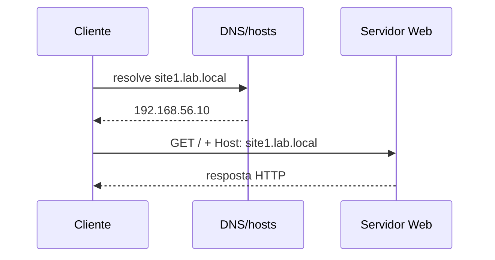

# 18. Servidor Web

<div class="lesson-meta"><span>Aula 18</span><span>4 aulas</span><span>Serviços</span></div>

## Objetivos

- explicar requisição HTTP, porta e virtual host
- instalar e configurar Apache ou Nginx
- publicar dois sites por nome
- usar logs e testes de configuração

## Caminho de uma requisição



## Instalação

=== "Apache"

    ```bash
    sudo apt install apache2
    sudo systemctl enable --now apache2
    apachectl configtest
    ```

=== "Nginx"

    ```bash
    sudo apt install nginx
    sudo systemctl enable --now nginx
    sudo nginx -t
    ```

## Testes

```bash
curl -I http://127.0.0.1
curl -v http://site1.lab.local
ss -lntp | grep ':80'
```

## Virtual hosts

Um virtual host seleciona configuração conforme nome/endereço da requisição. Cada site deve possuir raiz, logs e permissões coerentes.

Estrutura:

```text
/srv/www/site1/
/srv/www/site2/
```

## Logs

=== "Apache"

    ```bash
    sudo tail -f /var/log/apache2/access.log
    sudo tail -f /var/log/apache2/error.log
    ```

=== "Nginx"

    ```bash
    sudo tail -f /var/log/nginx/access.log
    sudo tail -f /var/log/nginx/error.log
    ```

!!! warning "Não reinicie com configuração inválida"
    Execute o teste de sintaxe. Quando possível, use `reload` para aplicar mudanças sem interromper conexões.

## Prática guiada

1. Instale Apache ou Nginx.
2. Crie `site1.lab.local` e `site2.lab.local` com conteúdos diferentes.
3. Configure resolução no cliente.
4. Teste cada nome com `curl` e navegador.
5. confirme logs separados ou identificáveis.
6. altere uma página e observe nova requisição no log.
7. aplique firewall para a rede do laboratório.
8. valide após reinicialização.

## Desafio

Introduza um erro de sintaxe controlado. Mostre que o teste detecta o problema antes do reload, corrija e prove que o serviço permaneceu disponível.

## Evidência de entrega

<div class="evidence-box">
Arquivos de virtual host, testes por nome, códigos HTTP, logs e saída do teste de configuração.
</div>

## Checklist

- [ ] dois sites respondem pelo nome correto
- [ ] a raiz de cada site está separada
- [ ] a sintaxe foi validada
- [ ] o firewall permite HTTP apenas onde necessário
- [ ] os logs confirmam as requisições
- [ ] o serviço persiste após reboot


