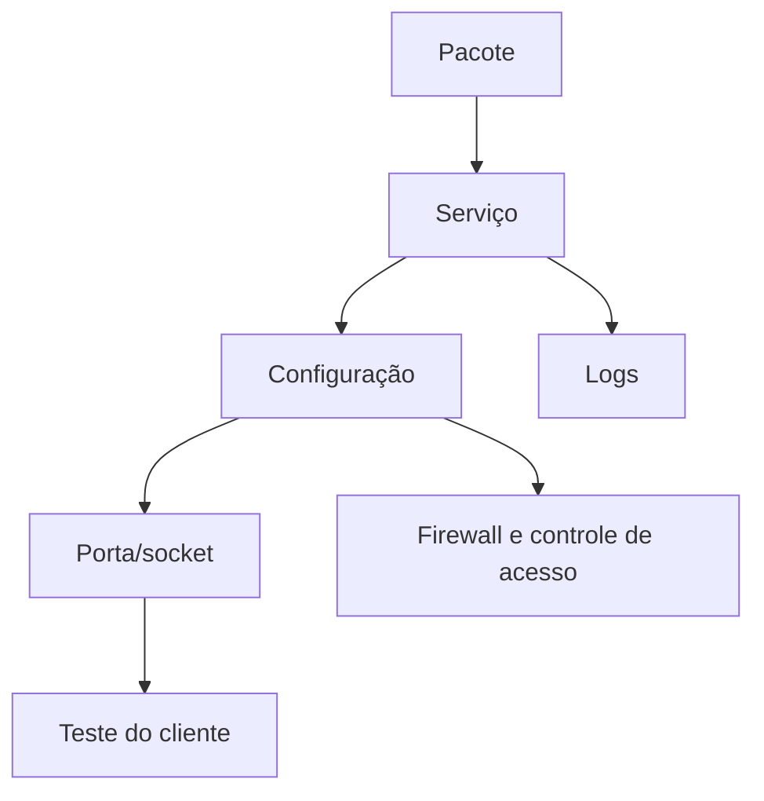

# Unidade IV — Serviços de servidor

Nesta unidade, o sistema operacional passa a oferecer serviços para clientes da rede. Cada implantação deverá considerar função, porta, processo, arquivo de configuração, logs, autenticação, firewall e teste remoto.

## Modelo de análise

[Iniciar pela Aula 17](17-impressao-cups.md){ .md-button .md-button--primary }
